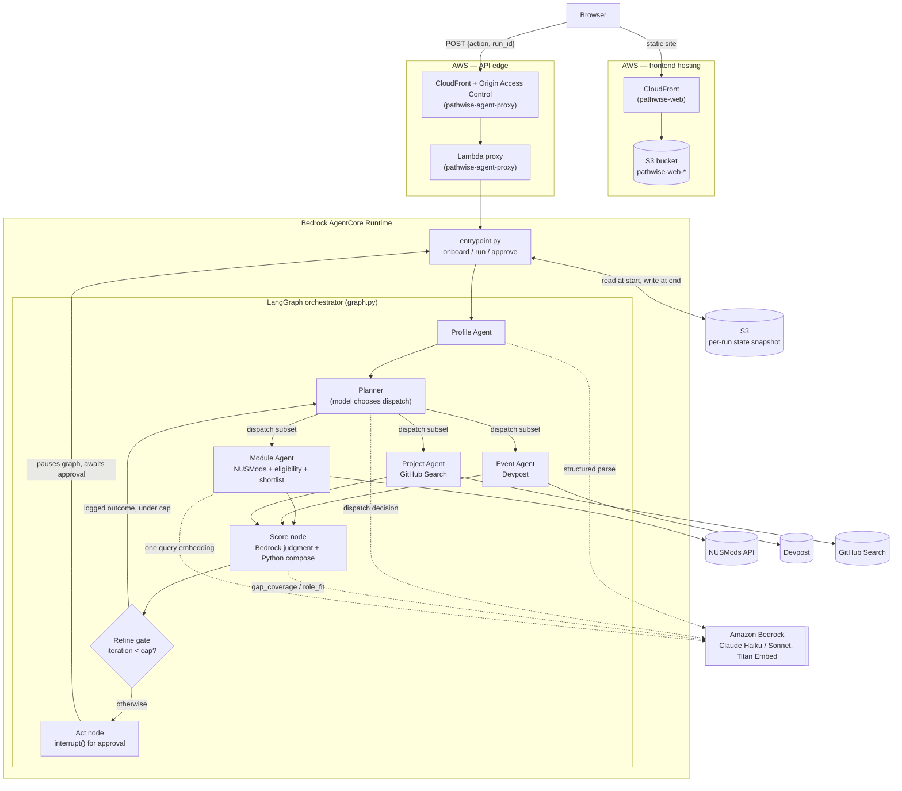

# Pathwise

**An agentic career readiness system for NUS students**, built for the **IGNITE Agentic AI
Hackathon 2026**.

Pathwise assesses a student's readiness for a target tech role from their transcript and resume,
dispatches sub-agents to gather live candidates — modules, hackathons, projects — from NUSMods,
Devpost and GitHub Search, scores those candidates against the student's ranked skill gaps, and
**re-plans automatically** when the student logs a real-world outcome such as a rejected
hackathon application. Every decision the system makes is written to an auditable trace that
renders directly in the UI, so a recommendation is never just a number — it's a chain of
reasoning a judge (or a student) can actually follow.

**Live demo:** https://duijbpwm96csz.cloudfront.net/

---

## Table of contents

- [What it does](#what-it-does)
- [Architecture](#architecture)
- [Tech stack](#tech-stack)
- [Prerequisites](#prerequisites)
- [Setup — deploy the full webapp](#setup--deploy-the-full-webapp)
- [How scoring and re-planning work](#how-scoring-and-re-planning-work)
- [Repository layout](#repository-layout)
- [Known limitations](#known-limitations)
- [Team](#team)

---

## What it does

1. **Onboard.** The student's transcript and resume are parsed (Bedrock, structured output) into
   a `StudentProfile` and a `Readiness` assessment — a score and a ranked list of gaps across five
   dimensions (programming, systems, data, tooling, communication), weighted by their target role.
2. **Plan.** A planner node — the *only* place in the system where a model determines control
   flow — decides which sub-agents are worth dispatching this run given the top-priority gap.
   Every skip is logged with a reason; a skip is a decision, not a silence.
3. **Gather.** Up to three sub-agents run in parallel, each wrapping one live data source:
   - **Module Agent** — NUSMods module catalogue, filtered by real prerequisite eligibility and
     ranked by a semantic shortlist over a precomputed embedding index.
   - **Event Agent** — Devpost hackathons matching the current top gap.
   - **Project Agent** — GitHub repositories matching the current top gap.
4. **Score.** One batched Bedrock call judges every candidate's gap coverage and role fit; time
   cost and a redundancy penalty (skip recommending what the student already has evidence of) are
   computed deterministically in Python. Four decomposable components combine into one weighted
   total — never an opaque match percentage.
5. **Act, with a human in the loop.** The graph pauses on an `interrupt()` and proposes one action
   per ranked candidate. Nothing executes until the student approves it, and one action type
   (`submit_application`) can never be auto-approved, in code, no matter what a request claims.
6. **Refine.** When the student logs an outcome — accepted, rejected, withdrew — it feeds back
   into the planner, which re-plans against a hard, config-driven iteration cap that ignores the
   model's own judgement about whether it's "done."

## Architecture



**Why it's shaped this way:**

- **Only the planner exercises model judgement over control flow.** Everything downstream —
  eligibility filtering, the semantic shortlist, `time_cost`/`redundancy_penalty`, the weighted
  total, the refine-loop cap — is deterministic Python, so a ranking is reproducible and every
  step is defensible out loud, not just "the model said so."
- **The browser never talks to AgentCore directly** — that requires SigV4-signed AWS credentials.
  A Lambda holding the IAM permission sits behind a CloudFront distribution with an Origin Access
  Control, so the site calls a plain public HTTPS endpoint.
- **The `web/` static site gets its own separate CloudFront distribution** purely so it's served
  over HTTPS — an S3 website endpoint is HTTP-only, and the frontend's request-signing
  (`crypto.subtle.digest`) only exists in a secure context.
- **Every external call — Bedrock, NUSMods, Devpost, GitHub — has a timeout, one retry, and a
  fixture fallback** that writes a trace entry recording that the fallback fired, so a demo run
  degrades gracefully and visibly instead of hanging or lying about its data source.

## Tech stack

| Layer | Technology |
|---|---|
| Orchestration | [LangGraph](https://github.com/langchain-ai/langgraph) — explicit graph of nodes/edges, `InMemorySaver` checkpointer for interrupt/resume |
| Agent runtime | [Amazon Bedrock AgentCore Runtime](https://aws.amazon.com/bedrock/agentcore/) (`bedrock-agentcore` SDK), deployed via the AgentCore starter toolkit |
| Models | Anthropic Claude (Haiku for planning/scoring/parsing, Sonnet as a transcript-parsing fallback) and Amazon Titan Text Embeddings v2, all called via `boto3`'s `bedrock-runtime` client — model ids are never hardcoded, only read from `src/config.py` |
| Backend language | Python 3.11, [Pydantic](https://docs.pydantic.dev/) for every type crossing a module boundary |
| Data sources | [NUSMods API](https://api.nusmods.com/) (module catalogue + prerequisites), [Devpost](https://devpost.com/) (hackathons), [GitHub Search API](https://docs.github.com/en/rest/search) (projects) |
| Vector search | Brute-force cosine similarity (`numpy`) over a precomputed, offline-built module embedding index — no vector database |
| Frontend | Vanilla HTML/CSS/JavaScript (`web/`) — no build step, no framework; one `render()` that rebuilds the DOM from application state |
| API edge | AWS Lambda (proxy, holds IAM permission to invoke AgentCore Runtime) behind CloudFront with an Origin Access Control |
| Frontend hosting | S3 static website behind its own CloudFront distribution (for HTTPS) |
| State persistence | S3 (per-run state snapshot, JSON) |
| CI | GitHub Actions — `ruff check` + `pytest` on every PR, run against `data/fixtures/` with no AWS credentials available, on purpose |
| Deploy tooling | `infra/deploy.py` — one command chaining `agentcore launch`, the Lambda proxy, both CloudFront distributions, and the web upload |

## Prerequisites

- **An AWS account with Bedrock model access** in `us-east-1` for Claude Haiku, Claude Sonnet,
  and Titan Text Embeddings v2. (This project was built against a hackathon-issued AWS sandbox
  account with temporary STS credentials that expire every 12 hours — see [Setup](#setup--deploy-the-full-webapp).)
- **Python 3.11+**
- **[AWS CLI](https://aws.amazon.com/cli/)** configured, or the three AWS environment variables
  set directly (see `.env.example`)
- **The AgentCore starter toolkit**, which provides the `agentcore` CLI used to build and push the
  AgentCore Runtime container:
  ```bash
  pip install bedrock-agentcore-starter-toolkit
  agentcore configure   # first time only, on a fresh machine
  ```
- **Node.js** — the AgentCore toolkit's build step uses it (`node_version: '20'` in
  `.bedrock_agentcore.yaml`); install Node 20 if `agentcore launch` complains about it missing.
- **Docker**, if the AgentCore toolkit's container build step requires it locally (depends on the
  toolkit version and build mode; `agentcore launch` will say so if it's needed and missing).
- **`gh`** (GitHub CLI), only if you intend to open PRs against this repo per its own git workflow.

## Setup — deploy the full webapp

The fastest way to see it working is the live demo above. To deploy your own copy end to end:

1. **Clone and install Python dependencies**
   ```bash
   git clone <this-repo-url>
   cd pathwise
   python -m venv .venv && source .venv/bin/activate
   pip install -r requirements.txt
   pip install bedrock-agentcore-starter-toolkit   # provides the `agentcore` CLI
   ```

2. **Fill in `.env`**
   ```bash
   cp .env.example .env
   ```
   Then edit `.env`:
   - `AWS_ACCESS_KEY_ID`, `AWS_SECRET_ACCESS_KEY`, `AWS_SESSION_TOKEN` — from your AWS account's
     temporary credentials (all three are required; these are STS credentials, not a permanent
     IAM user).
   - `AWS_REGION` — `us-east-1`, where Bedrock access is granted for this project.
   - `S3_BUCKET` — a globally-unique bucket name for run-state snapshots.

3. **Discover which model ids your account can actually call**
   ```bash
   python verify_aws.py
   ```
   This authenticates, lists callable Claude models in your region, and makes one real Bedrock
   call to confirm access. Paste the exact ids it prints into `.env` as `MODEL_HAIKU` and
   `MODEL_SONNET`.

4. **Deploy everything with one command**
   ```bash
   python infra/deploy.py
   ```
   This chains, in order:
   1. `agentcore launch` — builds and pushes the AgentCore Runtime container for
      `src/entrypoint.py`, forwarding `MODEL_HAIKU`/`MODEL_SONNET` into the deployed runtime's
      environment.
   2. Creates/updates the Lambda proxy in front of AgentCore Runtime (with its own IAM role).
   3. Creates/updates a CloudFront distribution (with an Origin Access Control) in front of that
      Lambda — the public API endpoint.
   4. Uploads `web/` to an S3 static site wired to that CloudFront domain, then fronts *that* site
      with its own CloudFront distribution for HTTPS.

   Every step is idempotent, so re-running this same command after further changes updates the
   live deployment in place.

5. **Visit the printed Site URL.** First-time CloudFront propagation can take 5–15 minutes; a
   plain code/content update is much faster.

## How scoring and re-planning work

- **Four decomposable score components**, never one opaque match percentage:
  `gap_coverage` and `role_fit` come from a single batched Bedrock call judging every candidate at
  once; `time_cost` and `redundancy_penalty` are computed with pure, unit-tested Python — no
  network, no model — from the candidate's cost estimate and the dimensions the student already
  has resume evidence for. The four combine into one weighted `total` per
  `config.SCORE_WEIGHTS`.
- **Eligibility before scoring.** The Module Agent filters out modules the student cannot
  actually take (real NUSMods prerequisite trees, evaluated per-candidate) before anything is
  scored — no tokens spent recommending something ineligible.
- **A candidate the student has already decided on never resurfaces.** Anything with a logged
  `Outcome` — accepted, rejected, or withdrew — is dropped before scoring on every subsequent
  pass, deterministically, so a re-plan's changed ranking is guaranteed to reflect the new
  decision rather than depending on the planner alone.
- **The refine loop has a hard cap** (`MAX_REFINE_ITERATIONS`, currently 3) read from config and
  checked unconditionally — it overrides whatever the model itself might otherwise decide.
- **Nothing executes without approval.** The act node always pauses on `interrupt()` before
  taking any action, and one action type (submitting an application) can never be
  auto-approved, enforced in code rather than only in the UI.

## Repository layout

```
pathwise/
├── src/
│   ├── config.py        shared constants — model ids, weights, hard caps (frozen)
│   ├── state.py          shared type contract — Candidate, RunState, etc. (frozen)
│   ├── graph.py           LangGraph wiring: profile → planner → fan-out → score → refine/act
│   ├── entrypoint.py      AgentCore @app.entrypoint — onboard / run / approve
│   ├── scoring.py         pure scoring math, no I/O
│   ├── metrics.py         run metrics (tokens, fallbacks, validations) for the eval slide
│   ├── snapshot.py        S3 read-at-start / write-at-end run-state snapshot
│   ├── agents/            profile, planner, module, event, project nodes
│   └── tools/             nusmods, devpost, github, retrieval (semantic shortlist), eligibility
├── web/                  static frontend — index.html, app.js, styles.css
├── infra/                deploy scripts (Lambda proxy, both CloudFront distributions, S3 site)
├── data/
│   ├── fixtures/          committed sample data — what CI runs against, and every fallback path
│   └── index/              precomputed module embedding index (built by build_module_index.py)
├── tests/
├── build_module_index.py  offline script: embeds the NUSMods catalogue once, commits the index
├── verify_aws.py          preflight check: credentials, model access, one real Bedrock call
├── PLAN.md               file ownership, workstreams, git workflow — source of truth
└── CLAUDE.md              hard rules for anyone (human or agent) working in this repo
```

## Known limitations

Written down rather than glossed over, in the spirit of the project's own decision trace:

- **The "Internships" screen in the frontend is an illustrative placeholder.** No Internship
  Agent or data source was built — only NUSMods, Devpost and GitHub were in scope — and the UI
  labels it as such.
- **Approval resume only works within one warm AgentCore process.** The S3 snapshot recovers a
  fresh `onboard`/`run` call across a container restart, but not an in-flight `interrupt()` — an
  `approve` call arriving at a container that never held that interrupt fails. Acceptable at this
  deploy's scale (one warm container for the demo), flagged rather than hidden.
- **The transcript and resume parsed at onboarding are the fixtures committed in
  `data/fixtures/`, not a per-request upload** — accepting a student's own transcript would need
  a change to the frozen state contract, which is out of scope for this build.

## Team

Built for IGNITE Agentic AI Hackathon 2026 by a team of four:

| | Owner |
|---|---|
| Orchestration & data sources | **Alvin** |
| Frontend, deploy & evaluation | **Aaron** |
| Profile ingestion & evaluation | **Stevson** |
| Product story & deliverables | **Samuel** |
